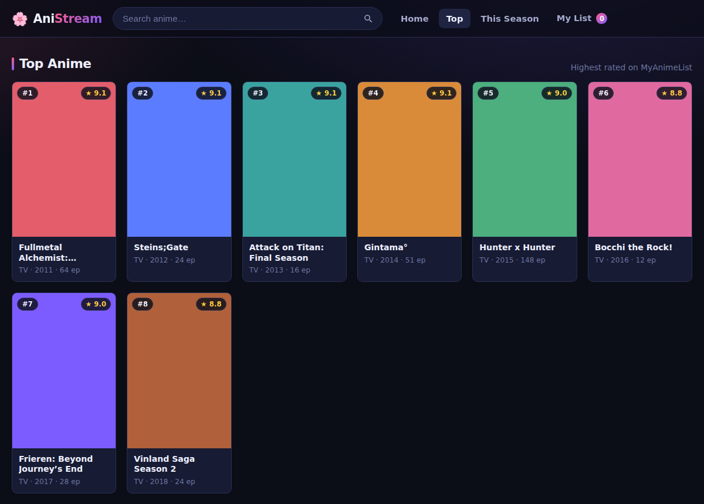

# 🌸 AniStream

A clean, responsive **anime discovery & watch-tracker** web app. Browse top-rated
and currently-airing anime, search by title or genre, watch official trailers,
and build a personal watchlist — all in a zero-dependency static site.



## Features

- **Home** — a featured hero (#1 top-rated), "Airing Now", and "Top Rated" rows
- **Top Anime** — the all-time highest rated, with pagination
- **This Season** — everything currently airing
- **Search & genres** — full-text search plus one-click genre filters
- **Detail view** — synopsis, score/rank/popularity/members, studio, an embedded
  **YouTube trailer**, and a link to the MyAnimeList page
- **My List** — add anime as *Watching*, *Plan to Watch*, or *Completed*;
  persisted in `localStorage` and grouped into tabs
- Polished dark UI: skeleton loaders, hash-based routing, keyboard-accessible
  cards, a modal detail overlay, and a mobile nav

## Tech

No framework, no build step — just three files:

| File | Purpose |
|------|---------|
| `index.html` | Markup & app shell |
| `styles.css` | Design system & responsive layout |
| `app.js` | SPA router, API client, watchlist, rendering |

Data comes from the free [**Jikan API**](https://jikan.moe) (an unofficial
MyAnimeList API — no key required). Requests are serialized, spaced, and cached
in-memory to respect Jikan's rate limits, with automatic retry on `429`.

## Running

It's a static site — serve the folder with anything:

```bash
# Python
python3 -m http.server 8080

# or Node
npx serve .
```

Then open <http://localhost:8080>. Opening `index.html` directly via `file://`
also works, though a local server is recommended so the API calls behave
consistently.

### Deploying

Push to any static host — GitHub Pages, Netlify, Vercel, Cloudflare Pages, etc.
No configuration needed.

## A note on "watching"

AniStream is a **discovery and tracking** app. It does **not** host or stream
any copyrighted video. "Watch" here means official trailers (embedded from
YouTube) plus links out to MyAnimeList — the app is a legal front-end over
public metadata.

## Attribution

Anime data & trailers via the [Jikan API](https://jikan.moe) / MyAnimeList.
